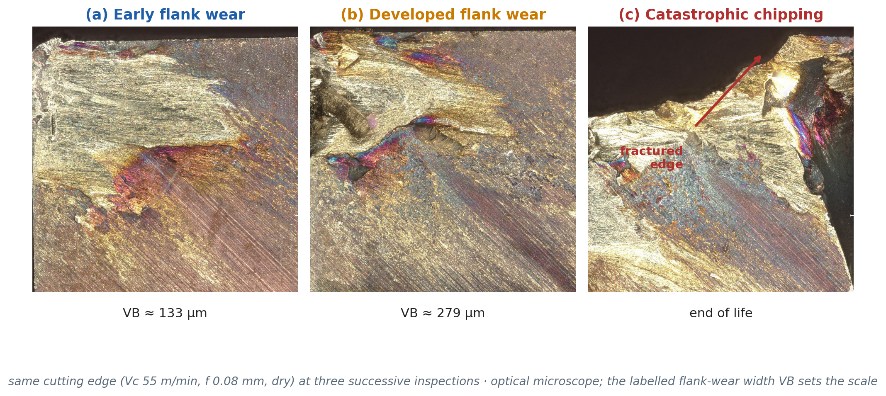
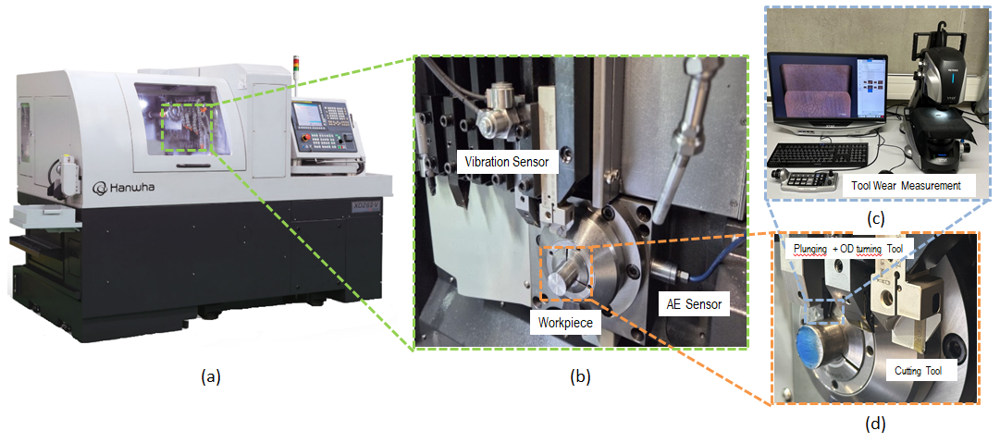
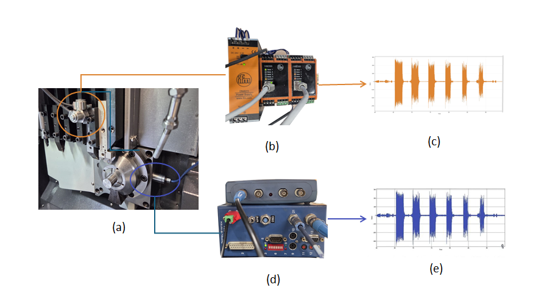
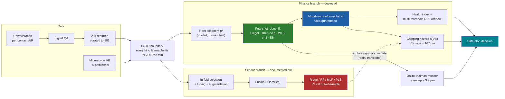
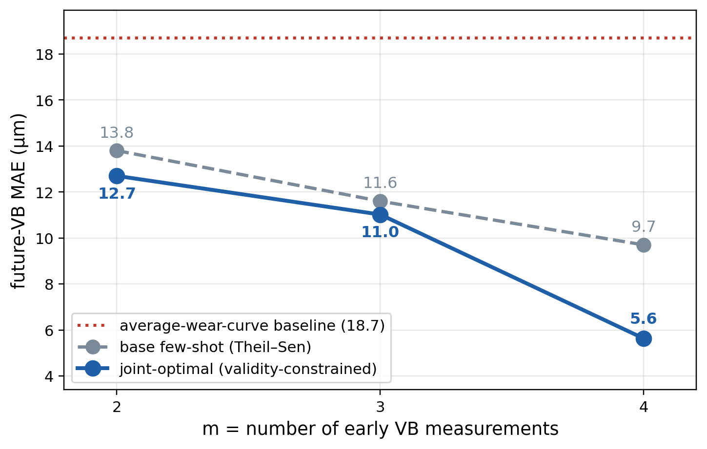
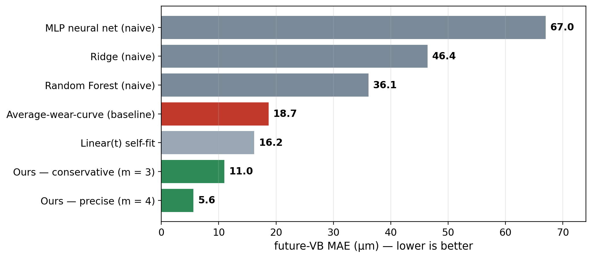
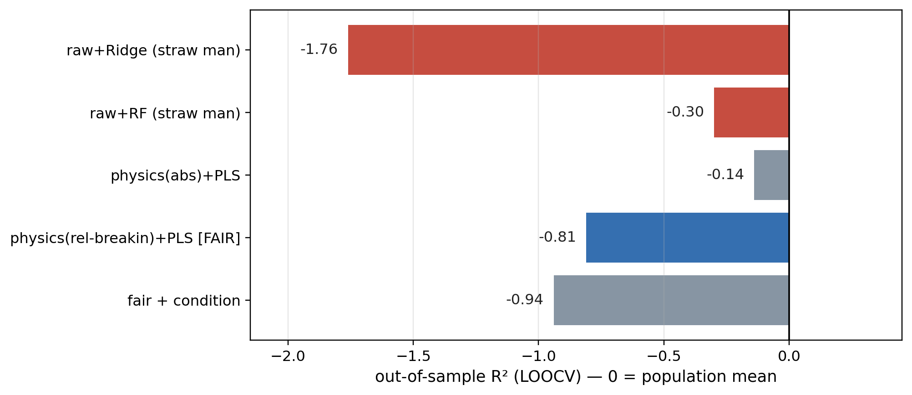
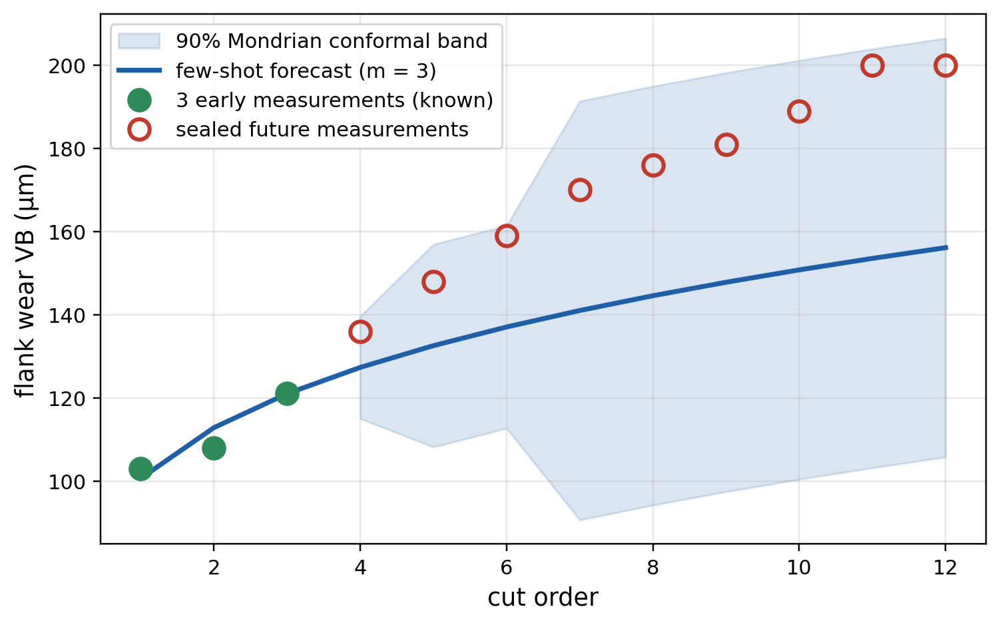
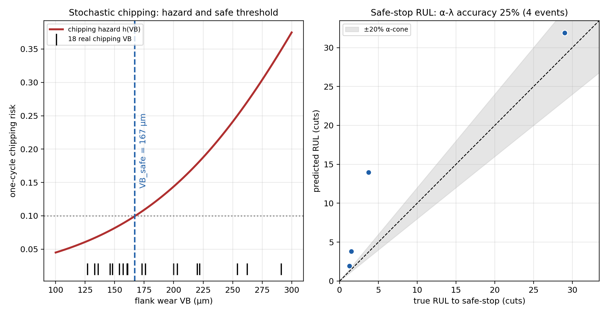
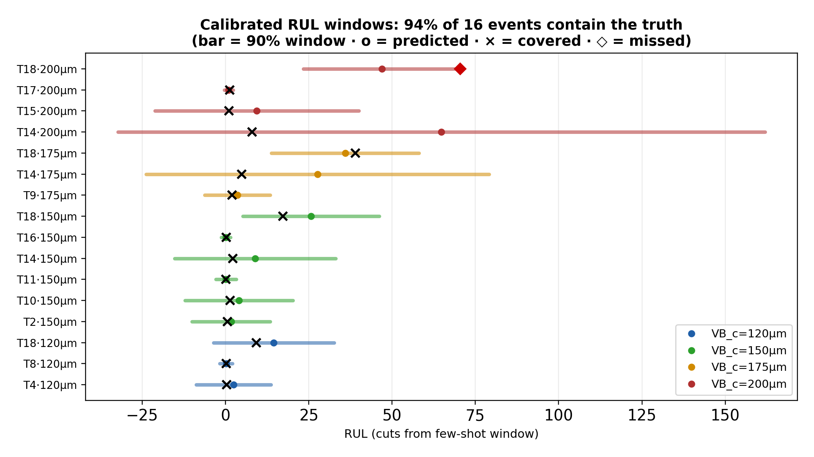

<div align="center">

# Minimum-Data, Physics-Integrated Few-Shot Prognosis of Cutting-Tool Flank Wear

**From three or four early microscope measurements of a never-seen tool to a calibrated wear
forecast, a guaranteed-coverage uncertainty band, and a chipping-safe stop decision.**

[](https://github.com/sudomanuel/minimum-data-tool-wear-prognosis/actions/workflows/ci.yml)
[](https://www.python.org/downloads/)
[](https://scikit-learn.org/)
[](https://scipy.org/)
[](LICENSE)



*One cutting edge across its life: flank wear grows gradually — end of life arrives abruptly, by
edge fracture. That asymmetry defines everything this repository does.*

</div>

---

## Abstract

This repository contains a complete, reproducible prognostics-and-health-management (PHM) system for
cutting-tool **flank wear** `VB (µm)` under **genuine data scarcity**: an 18-tool full factorial
campaign (cutting speed × feed × cooling) with **one tool per condition**, roughly **five microscope
inspections per tool**, and **every tool ending in a sudden catastrophic chipping** of the cutting
edge. From only the first `m = 3–4` measurements of a held-out tool, the deployed model predicts the
unseen remainder of the wear curve to **5.6 µm** (2.8 % of the 200 µm wear criterion), wraps every
forecast in a **distribution-free conformal band** (90 % coverage, 25–52 µm), validates a calibrated
**remaining-useful-life window** on 16 interval-censored events (94 % contain the truth), and derives
a **chipping-safe stop threshold** (`VB_safe ≈ 167 µm`) from the campaign's 18 real failure events.

The repository is built as a scientific system, not a leaderboard: a leakage-safe evaluation protocol
fixed before modelling, every alternative method adjudicated under a pre-stated adoption rule, and
every negative result documented with the same rigor as the headline. **Across eight adversarial
audit rounds, roughly 35 competing methods were tested — none beat the deployed configuration.**
That resistance, and the honest map of what does *not* transfer in the minimum-data regime, is the
core contribution.

Two peer-review-grade manuscripts (English and Spanish, MDPI layout) are generated from the validated
results in this repository.

---

## Table of contents

| # | Section |
|--:|---|
| 1 | [The problem](#1--the-problem) |
| 2 | [The data, the machine and the experiments](#2--the-data) |
| 3 | [The pipeline](#3--the-pipeline) |
| 4 | [Headline results](#4--headline-results) |
| 5 | [The two branches — settled head-to-head](#5--the-two-branches--settled-head-to-head) |
| 6 | [Calibrated uncertainty](#6--calibrated-uncertainty) |
| 7 | [The failure model: stochastic chipping](#7--the-failure-model-stochastic-chipping) |
| 8 | [The adjudication programme (8 rounds, ~35 methods)](#8--the-adjudication-programme) |
| 9 | [External check on a public benchmark](#9--external-check-on-a-public-benchmark) |
| 10 | [What the cutting condition does — inferential DOE analysis](#10--what-the-cutting-condition-does) |
| 11 | [What is optimal now](#11--what-is-optimal-now) |
| 12 | [Reproducing the evidence chain](#12--reproducing-the-evidence-chain) |
| 13 | [Repository layout](#13--repository-layout) |
| 14 | [Project history](#14--project-history) |
| 15 | [Claims discipline](#15--claims-discipline) |

---

## 1 — The problem

Measuring flank wear is destructive and slow: the machine must stop and the tool must be inspected
under an optical microscope. Industrial reality therefore delivers **few labels per tool**. A
controlled design of experiments spends its budget covering many cutting conditions rather than
replicating any single one, so there is typically **one tool per condition** — which statistically
confounds the effect of the condition with natural tool-to-tool variability. And end of life arrives
**abruptly by edge chipping**, not through a gradual, densely sampled wear-out.

This regime is the opposite of the large, balanced, run-to-failure datasets that mainstream
data-driven prognostics implicitly assume. The question asked here is deliberately a minimum-data
one:

> *From only the first few VB measurements of a previously unseen tool, can we predict the remainder
> of its wear trajectory and its remaining useful life — with uncertainty that is quantified and
> trustworthy rather than merely indicative?*

---

## 2 — The data

| Property | Value |
|---|---|
| Campaign | 18 tools = full 3 × 3 × 2 factorial (v_c {55, 70, 80} m/min × f {0.08, 0.2, 0.3} mm × dry/coolant) |
| Replication | **one tool per condition** (unreplicated DOE — the central constraint) |
| Wear label | flank wear `VB (µm)`, optical microscope, ~5 inspections per tool (172 cycle records) |
| Vibration | axial (A) and radial (R) channels, segmented per contact (6 contacts per cycle) → 294 features, curated to 181 |
| End of life | **18 observed catastrophic chipping events** — wear-at-chipping disperses from 127 to 291 µm |
| Regime analysed | `VB ≤ 300 µm`; 200 µm retained as the ISO-style wear criterion |

The dispersion of the wear level at which chipping occurs (127–291 µm) is the physical signature of a
**stochastic failure mechanism**: a fixed wear threshold is the wrong end-of-life definition, which
motivates the hazard treatment of Section 7.

### Machine, instrumentation and workpiece

The campaign was run on a **Hanwha XD26II-V Swiss-type turning centre** (sliding headstock with guide
bushing) at the KSF Institute for Advanced Manufacturing. The workpiece is **stainless steel 1.4571**
machined with a **VSP K2P coated-carbide insert**. Flank wear `VB` is measured off-machine after each
cycle on a **Keyence VHX-7000** optical microscope. Two sensor families are acquired per machining
cycle: **axial and radial piezoelectric accelerometers** (vibration) and an **acoustic-emission (AE)**
channel.

<div align="center">

</div>

*(a) the Hanwha XD26II-V; (b) the in-process sensor placement — vibration sensor, AE sensor and the
workpiece at the guide bushing; (c) the Keyence VHX-7000 wear-measurement station; (d) the plunging +
OD-turning cutting tool.*

### The machining cycle (intermittent cutting)

Each experiment is an **indivisible cycle of six machining contacts**, executed in one of two
strategies:

- **Strategy 1** — five consecutive radial plunge operations at 3 / 2 mm spacings followed by
  parting-off (≈ 60 mm of machined length per cycle).
- **Strategy 2** — a combined cycle of radial plunging **plus axial (OD) turning** over the guide-bush
  length, then parting-off, which reproduces real outer-diameter-turning wear.

The six contacts produce the **six energy bursts seen per cycle** in the vibration record — the same
per-contact segmentation the feature pipeline consumes. Wear `VB` is read once, ex-situ, at the end of
each cycle, so only a handful of labels exist per tool.

### Which sensor carries the wear signal

Recording both channels lets the wear signal be located empirically rather than assumed. **Axial
vibration shows the strongest correlation with flank wear** (|r| ≈ 0.76); the **acoustic-emission
features were excluded** (|r| ≈ 0.27). The analysis therefore builds on the axial/radial accelerometer
channels.

<div align="center">

</div>

*(a) the sensors on the machine → (b, c) the vibration acquisition module and its signal; (d, e) the
acoustic-emission acquisition hardware and its signal. Both show the burst-per-contact structure of a
machining cycle.*

### Why conventional wear detection is hard here (the process physics)

Two machine-level effects confound naïve feature–wear correlations, and are the reason the framework
leans on the physics of the wear curve rather than on the raw signal magnitude:

1. **Variable rotational speed.** A constant cutting speed means the spindle speed varies with
   diameter; the feed tracks the spindle speed, so each pass carries different frequency content.
2. **Bar-feeder length.** A longer bar in the feeder draws a higher spindle-current load; that load
   falls as the bar shortens, directly **conflicting with the rising cutting force from wear**.
   (Compensating this effect by integrating the live workpiece length via OPC-UA is a documented
   process-side refinement.)

Day-to-day thermal drift also enters the signals unrelated to wear, so the feature analysis focuses on
descriptors that stay **stable across the whole tool life**. These physical realities — not a modelling
choice — are why the sensor branch, given every fair chance, does not transfer across tools
(Section 5).

> **Experimental scope.** The full campaign is the 3 × 3 × 2 factorial above (18 conditions, one tool
> each); one tool was additionally taken **new → end of life over a long-duration run** (v_c 55 m/min,
> f 0.08 mm/rev, coolant), which supplies the deepest single wear trajectory in the set. Earlier
> progress snapshots described only a subset of these runs; the machine, instrumentation and procedure
> documented here are those of the completed campaign.

---

## 3 — The pipeline



**Evaluation protocol — leakage-safe leave-one-tool-out (LOTO).** In every fold one tool is held out
entirely; models train on the other 17. The held-out tool contributes only its first `m`
measurements; everything beyond `m` is sealed and used exclusively for scoring. Scaling, selection,
tuning and augmentation are fit inside the training fold. The protocol, wear regime, and failure
threshold were fixed **before** modelling.

**The deployed model** is deliberately simple — and demonstrably the strongest available at this data
scale. Wear follows a monotone power law `VB(t) = b + a·t^p` (`a > 0`, `0 < p < 1`: non-decreasing
and concave by construction). The exponent `p` is learned once on the training fleet (pooled SSE,
m-matched, with a locally shrunk per-tool refinement); the level `b` and rate `a` are fit to the new
tool's own `m` early points by robust estimators (Siegel / Theil–Sen), extrapolation-weighted
(`w ∝ τ^γ`, γ = 3 chosen by a pooled-R² stopping rule) at `m = 4`, and shrunk toward the fleet rate
(empirical Bayes ≡ fixed-δ power prior) at `m = 2`.

The consolidated research findings, including the full negative-results catalogue, are in
[`CONCLUSIONS.md`](CONCLUSIONS.md).

---

## 4 — Headline results

All numbers are leakage-safe LOTO on the 18-tool campaign, bit-reproducible from the scripts listed
in Section 12 (13/13 producers verified byte-identical; 14/14 manuscript claims traced to result
files).

| Quantity | Value | Where |
|---|---|---|
| Future-VB error, `m = 4` (deployed optimum) | **5.6 µm MAE** · pooled R² 0.70 · MAPE 3.2 % | `run_record_attempts2.py` |
| Future-VB error, `m = 3` (conservative) | 11.0 µm · R² 0.50 | `run_optimal_config_search.py` |
| Baseline (average wear curve of the fleet) | 18.7 µm · R² −1.31 | `run_final_eval.py` |
| Paired significance at `m = 4` | improvement on **18/18 tools** (sign test p ≈ 8·10⁻⁶) | `run_a_paired_significance.py` |
| Selection honesty (nested double-LOTO) | nested 5.60 vs reported 5.63 → **zero selection optimism** | `run_b_nested_selection.py` |
| Conformal band (90 % target) | 90.1 % coverage · 52.5 µm mean · **±19 µm near-horizon** · 25.1 µm @ 92 % at `m = 4` | `run_f5_adaptive_conformal.py` |
| RUL window validation | 16 interval-censored events · **94 % contain the true crossing** | `run_f1_multithreshold_rul.py` |
| Chipping-safe stop | `VB_safe = 167 µm` (one-cycle risk ≤ 0.10) from 18 real failures | `run_r3_chipping_rul.py` |
| Online monitor (Kalman, adaptive Q) | one-step-ahead ≈ **3.7 µm** | `run_record_attempts2.py` |
| Life-normalized accuracy | 5.6 µm = **2.8 %** of the 200 µm criterion | — |

<div align="center">


</div>

**Honesty notes carried in the manuscript itself:** the per-tool R² is ill-conditioned on short
low-variance windows (absolute-error metrics lead); the point RUL at short horizons is bounded by
the one-cut inspection grid (11 of 16 events demand sub-grid accuracy for a ±20 % cone); and the
bootstrap CI of the mean gain at n = 18 is wide ([0.1, 15.8] µm) even though the direction is
unanimous.

---

## 5 — The two branches — settled head-to-head

The obvious data-driven route — reading wear from vibration features — **does not generalise across
tools** in this campaign. This is not asserted; it was given every fair chance and then settled with
a deliberately handicapped duel:

- **Fair chance:** compact physics indicators anchored at the tooth-passing frequency, break-in
  normalisation, PLS with in-fold component selection, health-indicator quality gate. Best result:
  R² ≈ 0 (radial channel alone), MAE 35.5 µm — trendable *within* a tool (0.82) but with
  cross-tool prognosability of only **0.04**.
- **Six fusion families** (early concatenation, decision-level averaging, stacking, CCA, multiblock
  PLS, dimensionless A/R ratios): every one sits **below** the best single channel. The best fusion
  is no fusion.
- **The duel:** on the same held-out future cuts, physics forecasts *blind* from the first `m`
  points, while the sensor branch is allowed to **read the vibration at the very cut it must
  predict**. Physics wins anyway — **5.6 vs 35.2 µm at `m = 4`, better on 16/18 tools (Wilcoxon
  p < 10⁻⁴)**. The live signal carries the cutting condition, not the tool-specific wear state.

<div align="center">

</div>

The branch is retained as a **documented null** — and its one productive residue: radial transient
indicators (spectral kurtosis) show exploratory value as **chipping-risk covariates**
(LRT p = 0.010, not Holm-robust across the screened family; reported strictly as exploratory).

---

## 6 — Calibrated uncertainty

Every forecast carries a **distribution-free conformal band** built from LOTO calibration residuals,
refined by a horizon-adaptive (Mondrian) scheme: near (≤1 step), mid (2–3), far (≥4) bins with a
per-bin fallback rule. Result: 90.1 % empirical coverage at 52.5 µm mean width, ±19 µm near-horizon
(9 % of the 200 µm budget), tightening to 25.1 µm @ 92 % at the precise operating point.

Nine alternative interval constructions were tested under a pre-stated coverage rule and rejected —
CQR (under-covers, 82 %), jackknife+/CV+ (collapses to the global band), three normalized
nonconformity scores (the physics-rate score is the *worst*, 229 µm, because the concave law's slope
anti-correlates with forecast difficulty), severity-Mondrian (bin budget), kinematic-kernel weighting
(narrow widths come with 68–70 % coverage — a validity mirage), and conformalized survival bounds
(guarantee holds at 94 % but the bound is decision-useless at n = 16). **At a fixed 90 % guarantee
the interval sits at its data-imposed floor**; the exposed width–coverage–budget frontier is the
operational knob.

<div align="center">

</div>

---

## 7 — The failure model: stochastic chipping

Every tool in the campaign ends in an observed chipping event, so the campaign contains **18 genuine
end-of-life events** — not right-censored trajectories. Because the wear level at chipping is
dispersed (127–291 µm), end of life is a **hazard, not a level**: a discrete-time logistic hazard
`logit h(VB) = γ₀ + γ₁·VB` is fitted across all 172 cycle records (a discrete-time instance of the
degradation-threshold-shock family), and the decision threshold is

> `VB_safe = sup{ VB : h(VB) ≤ 0.10 } ≈ 167 µm`,

with the 200 µm level retained only as the ISO reference. The RUL is the time until the **upper edge**
of the calibrated band reaches `VB_safe` — conservative by construction. Under a censoring-correct
survival scoring rule the deployed model reaches −1.10 per tool against −2.39 (linear) and −2.71
(fleet baseline). The tertiary-acceleration extension (κ-continuation) is verifiably non-identifiable
inside these records and is kept as a robustness annex for gradual-failure regimes.

<div align="center">


</div>

---

## 8 — The adjudication programme

Eight adversarial audit rounds (internal committee + literature raids) tested roughly **35 competing
methods** under one pre-stated rule: *adopt only what beats the record at the same budget with valid
coverage.* Zero numeric adoptions — the deployed configuration survived everything. Selected verdicts
(consolidated in [`CONCLUSIONS.md`](CONCLUSIONS.md)):

| Family | Representative results (LOTO) | Verdict |
|---|---|---|
| Hierarchical Bayes / particle posterior predictive | 15.3 / 12.0 µm vs records 11.0 / 5.6 | fleet prior drags toward the population — rejected 3× (Kalman-forecast, commensurate-δ, particles) |
| Stochastic processes (IG with random effects; Wiener) | IG: 12.1 / **8.7** µm — best of the family, beats the base at m = 4, loses to the record | not adopted; strongest stochastic competitor on record |
| Canonical wear laws (Archard p = ½, extended Taylor, Usui) | 12.0 / 10.0 · 16–47 · marginal | cited, not adopted — fitting the exponent is what makes the law competitive |
| Condition-parameterized exponent p(x) | zero-shot loses at both budgets; p ~ condition R² = noise | condition-to-shape map unidentifiable at 1 replicate/condition |
| Similarity library (PHM'08 style) | 22–39 µm | fails without replicates |
| Model averaging over law forms (BMA) | fleet BIC puts **weight 0.997 on the power form** | model-form uncertainty closed by the data |
| Augmentation (physics-MC seeded, MTD/VSG, gamma process) — full K × S fleet-size sweep | neutral-to-harmful at every fleet size; blips within n = 18 noise | **replication ≠ augmentation**, now across the whole K axis |
| Meta-learning / transfer / GAN / deep | n = 18, domain ≡ confounder | non-starters, documented |
| Legacy-README methods re-audited under the current protocol (ElasticNet, SHAP-guided selection, PINN few-shot) | EN R² −0.75 · SHAP-select R² −0.40 · PINN 15.9 / 14.3 µm | all confirm the adjudicated picture (`run_readme_gap_audit.py`) |

> **The finding is the simplicity.** After eight rounds, "a simple physics law + robust few-shot
> fit + honest calibration" is not a limitation of this work — it is its central, demonstrated
> result for the minimum-data regime.

---

## 9 — External check on a public benchmark

The same machinery, unchanged, was run on the public **PHM2010** milling benchmark (three labelled
cutters, 315 cuts each, subsampled to a sparse inspection cadence; provenance authenticated in
`data/external/phm2010/README.md`). At `m = 3` the physics few-shot model transfers out of the box
(pooled R² 0.69; time-only extrapolation collapses at R² −0.49) but does **not** beat the fleet
average curve — and should not: PHM2010 is the *opposite* regime (a single condition realised by true
replicates, running through a gradual tertiary acceleration where the final fifth of life wears
2.6–7.6× faster). The external check **validates the method's scope claims rather than extending
them**: replication changes the winning model class, which is precisely the paper's thesis. A hybrid
"fleet shape + few-shot affine personalization" closes the gap there (15.2 vs 15.8 µm), confirming
the framework scales with replication (`run_e2_phm2010_hybrid.py`).

---

## 10 — What the cutting condition does

The predictive condition-to-wear map is foreclosed by the unreplicated design — but the
**inferential** question is answerable with the classical machinery for exactly this situation
(half-normal ordering of orthogonal contrasts, Lenth's pseudo-standard-error test, pooled-error
ANOVA). Result (`run_r6_unreplicated_doe.py`): the wear **rate** is condition-silent even
inferentially (best p ≈ 0.28 — the inferential echo of the failed rate transfer), while **cooling has
a detectable effect on the wear levels**: ~41 % of the explained variation of the break-in level and
~33 % of the wear-at-chipping (Lenth p = 0.015 / 0.020, ANOVA p = 0.001 / 0.002; directional — not
Holm-robust). Coherent with the deployed design: the condition acts on the **level**, which is
exactly the per-tool parameter the few-shot fit personalizes.

---

## 11 — What is optimal now

| Criterion | Current optimum | Caveat |
|---|---|---|
| Future-VB accuracy, minimum data | few-shot physics law, `m = 4`, γ = 3 — **5.6 µm** | selection-robust (nested check) |
| Conservative budget | `m = 3` Siegel + local exponent — 11.0 µm | m ≤ 3 searched optima are post-hoc; base model 11.6 is the selection-honest reference |
| Uncertainty | horizon-Mondrian 90 % — 52.5 µm mean, ±19 µm near | at the data-imposed floor; frontier exposed |
| End-of-life decision | `VB_safe = 167 µm` from the chipping hazard | 200 µm kept as ISO reference only |
| Live monitoring | adaptive-Q Kalman — 3.7 µm one-step | complementary to, not a substitute for, the few-shot forecast |
| Sensor branch | documented null (R² ≤ 0) | exploratory radial risk covariate only |
| Next unlock | **replicated campaign** (≥2 tools/condition) | the single binding constraint, confirmed by every round |

---

## 12 — Reproducing the evidence chain

```bash
git clone https://github.com/sudomanuel/minimum-data-tool-wear-prognosis.git
cd tool-wear-prediction
python -m venv .venv && .venv\Scripts\activate      # Linux/macOS: source .venv/bin/activate
pip install -r requirements.txt
```

The current evidence chain is driven by standalone producer scripts (all deterministic; re-runs are
byte-identical). The paper-facing set, in reading order:

| Stage | Script | Key output |
|---|---|---|
| m-curve + optimal configuration | `scripts/run_mcurve.py` · `run_optimal_config_search.py` · `run_optimal_config_final_metrics.py` | `results/optimal_config_*.csv` |
| Records (γ-weighting, adaptive-Q) | `scripts/run_record_attempts2.py` | `results/record_attempts2.csv` |
| Baselines + bootstrap | `scripts/run_final_eval.py` | `results/final_eval_*.csv` |
| Conformal layers | `scripts/run_conformal_rul.py` · `run_f5_adaptive_conformal.py` | `results/*conformal*.csv` |
| RUL windows (multi-threshold) | `scripts/run_f1_multithreshold_rul.py` | `results/f1_rul_*.csv` |
| Chipping hazard + safe stop | `scripts/run_r3_chipping_rul.py` | `results/r3_*.csv` |
| Fair sensor baseline + fusion bench | `scripts/run_f2_fair_baseline.py` · `run_r6_fusion_approaches.py` | `results/f2_*.csv`, `results/r6_fusion*.csv` |
| Branch head-to-head | `scripts/run_r6_branch_comparison.py` | `results/r6_branch_comparison.csv` |
| Paired significance + nested selection | `scripts/run_a_paired_significance.py` · `run_b_nested_selection.py` | `results/a_*.csv`, `results/b_*.csv` |
| Literature laws + audit rounds | `scripts/run_literature_laws.py` · `run_r4_*.py` · `run_r5_*.py` · `run_r7_*.py` · `run_r8*_*.py` | `results/*.csv` |
| Unreplicated-DOE inference | `scripts/run_r6_unreplicated_doe.py` | `results/r6_unreplicated_doe.csv` |
| External PHM2010 check | `scripts/run_e_phm2010_external.py` (+ `run_e2_phm2010_hybrid.py`) | `results/e_phm2010_*.csv` |
| README gap audit | `scripts/run_readme_gap_audit.py` | `results/readme_gap_audit.csv` |

The legacy single-tool pipeline (Section 14) remains runnable through `python run.py <task>`
(`python run.py` lists all tasks). Raw signals and microscope data are large/local and not in git;
the derived experiment table (`data/input/derived/features_experiment.csv`) drives every current
script.

---

## 13 — Repository layout

```
scripts/                    one runnable producer per experiment/audit (run_*, make_*, audit_*)
results/                    official metrics (CSV) — every manuscript number traces here
CONCLUSIONS.md              consolidated research findings, negative-results catalogue,
                            limitations and future work
data/
  input/derived/            features_experiment.csv (172 cycles × 18 tools) — the working table
  external/phm2010/         authenticated public-benchmark wear labels (+ provenance README)
outputs/
  figures/                  official figures (print/ = vector PDF + 600 dpi submission twins;
                            microscopy_src/ = source frames of Figure 1)
src/phm/                    legacy pipeline modules (segmentation, selection, PINN, RUL, export)
config/                     target lock, thresholds, physics constants
run.py                      entry point for the legacy staged pipeline (python run.py <task>)
```

---

## 14 — Project history

The project evolved in two phases, and their numbers are never mixed:

| Phase | Scope | Outcome |
|---|---|---|
| **Phase 1 (legacy)** — single-tool T01 study | 1 tool, 10 experiments, LOEO; PINN-centred pipeline (segmentation → 326 features → branches → fold-safe selection → temporal controls → PINN ablation → HI/RUL) | Revealed **temporal degeneracy** (a time-only line beats every sensor model on one tool) and hardened the discipline (fold-safe everything, leakage audits, honesty controls). Preserved in `run.py` tasks and `src/phm/`. |
| **Phase 2 (current)** — 18-tool minimum-data campaign | 18 tools, one per condition, LOTO few-shot; physics power law + conformal + chipping hazard | Everything documented above. The Phase-1 lessons (time controls, leakage audits, claim discipline) are its foundation. |

Phase-1 methods were re-audited under the Phase-2 protocol before this README was rewritten
(`scripts/run_readme_gap_audit.py`): ElasticNet (R² −0.75), SHAP-guided selection (R² −0.40) and a
few-shot PINN (15.9 / 14.3 µm) all confirm the adjudicated picture — nothing from the legacy stack
changes the current flow.

---

## 15 — Claims discipline

| We claim | We do **not** claim |
|---|---|
| 5.6 µm future-VB error from 4 early points, leakage-safe, selection-robust | that the gain is decisively significant in magnitude at n = 18 (CI [0.1, 15.8] µm; direction unanimous) |
| 90 % conformal coverage, empirically verified, at the data-imposed width floor | that tighter valid intervals are achievable by score engineering |
| A calibrated RUL **window** validated on 16 events (94 %) | point-RUL accuracy at short horizons (bounded by the inspection grid) |
| `VB_safe = 167 µm` from 18 real chipping events | that a fixed wear threshold defines end of life |
| The sensor branch is a documented null with a fair contest behind it | that vibration is useless — it is condition-dominated, and exploratorily informative for chipping risk |
| ~35 methods adjudicated under pre-stated rules | that any of them was rejected by opinion |
| The binding constraint is the unreplicated design | that more modelling can substitute for replication |

---

## Manuscripts and communication

- **Manuscript (EN):** *Minimum-Data Physics-Integrated Few-Shot Prognosis of Cutting-Tool Flank
  Wear with Calibrated Remaining Useful Life* — MDPI layout, 51 verified references, built entirely
  from the validated results in `results/`.
- **Manuscrito (ES):** full professional Spanish edition, same machinery.

---

<div align="center">

Licensed under the [MIT License](LICENSE) — built as a scientific system: where a result does not
hold, the repository says so.

</div>
